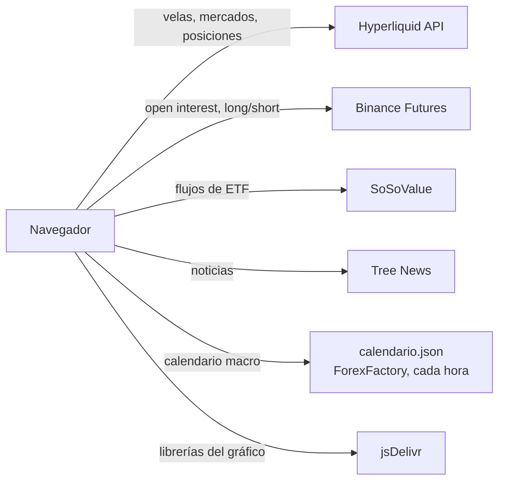

# Arquitectura

## En una frase

La terminal es **una página web estática**: HTML, CSS y JavaScript sin frameworks, que corre entera en el navegador y le pide los datos directamente a las APIs públicas. No hay servidor propio ni base de datos.



## Piezas

| Pieza | Qué hace |
|---|---|
| **Vela** | La librería de los gráficos del Indicador y de Aurora (velas, zoom, herramientas de dibujo). |
| **PineTS** | Ejecuta el Pine Script en el navegador, dentro de un *Web Worker* para no trabar la página. |
| **Módulos de sección** | Uno por sección (Contexto, Aurora, Grid, Spaghetti, Liquidaciones, Noticias). Cada uno se crea recién cuando abrís su pestaña, así la terminal arranca rápido. |
| **`app.js`** | El núcleo: arranque, detección en vivo/demo, navegación, ajustes, límite de pedidos a Hyperliquid y la sección Indicador. |

Vela y PineTS se descargan de jsDelivr en versiones fijas la primera vez que abrís el Indicador o Aurora, y las comparten las dos secciones.

## Cálculo separado de la interfaz

Cada sección tiene dos archivos:

- **`calc.js`**: fórmulas puras (medias, ATR, RSI, mapa de liquidaciones…). No tocan la página: reciben números y devuelven números.
- **`ui.js`**: pide los datos, llama a los cálculos y dibuja.

Separarlos hace que las fórmulas sean fáciles de revisar y de probar sin abrir la terminal.

## Arranque

1. Se muestra la pantalla de acceso y se verifica el usuario contra la lista de accesos (`app.dat`). La terminal no arranca hasta que la sesión es válida.
1. Se prueba la conexión con Hyperliquid (una consulta chica con 4 segundos de límite).
2. Si responde: **modo en vivo**. Si no: **[modo demo](../docs/modo-demo.md)** con el aviso y el motivo.
3. Se abre la sección de la dirección (`#contexto` si no hay ninguna).
4. Cada vez que abrís otra sección, se crea su módulo (solo la primera vez).

## Estructura de archivos

```
bull-army-terminal/
├── src/
│   ├── index.html             La página con todas las secciones
│   ├── css/styles.css         Estilos
│   ├── js/
│   │   ├── loader.js          Carga datos y scripts (solo en desarrollo)
│   │   ├── acceso/            cripto.js · gate.js (login) · admin.js (panel de Admin)
│   │   ├── app.js             Núcleo + Indicador
│   │   ├── contexto/          calc.js · ui.js
│   │   ├── aurora/            calc.js (réplica de Aurora y el Hull) · ui.js
│   │   ├── grid/              ui.js (screener en grilla)
│   │   ├── spaghetti/         calc.js · ui.js
│   │   ├── liquidaciones/     calc.js · source.js · ui.js
│   │   └── noticias/          ui.js
│   ├── data/                  Datos de muestra (modo demo)
│   ├── app.dat                Lista de accesos codificada
│   ├── manifest.webmanifest   PWA: nombre, colores e íconos
│   ├── sw.js                  PWA: service worker (sin caché)
│   ├── icons/                 Íconos de la app
│   └── pine/                  extremos.pine · aurora.pine · hull-suite.pine
├── scripts/                   build.mjs · serve.mjs
├── docs/                      Esta documentación
└── .github/workflows/         Publicación automática en GitHub Pages
```

Cómo se arma el archivo único a partir de estas piezas: ver [Modificar el código](modificar-el-codigo.md).
