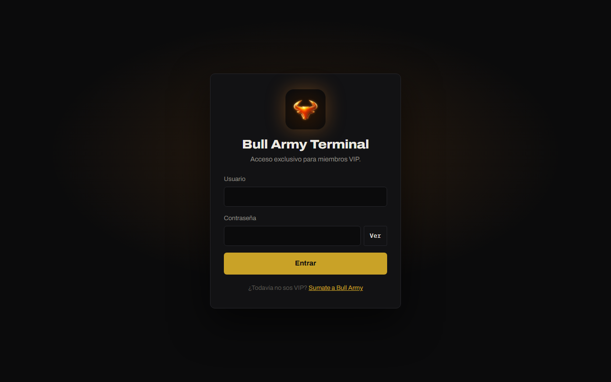

# Bull Army Terminal

La **Bull Army Terminal** reúne en una sola pantalla todo lo que un trader de Bull Army mira antes de operar: el contexto del mercado, el indicador **Extremos**, **Aurora**, un screener de varios mercados, un scanner de reversiones, zonas de confluencia, la comparación entre activos, el mapa de liquidaciones y las noticias. Todo con datos en vivo de [Hyperliquid](https://hyperliquid.xyz).

## Cómo entrar

La terminal es exclusiva para **miembros VIP** de Bull Army.

1. Abrí **https://camilolwi-oss.github.io/bull-army-terminal/**
2. Escribí el **usuario** y la **contraseña** que te dio Bull Army. El usuario no distingue mayúsculas; la contraseña sí. Con **Ver** podés mostrarla mientras la escribís.
3. Tocá **Entrar**.

La sesión queda guardada en ese navegador: la próxima vez entrás directo. Para salir, tocá **Salir** al pie del menú lateral (si usaste una computadora que no es tuya, cerrá sesión).

### Mensajes al entrar

| Mensaje | Qué hacer |
|---|---|
| *Usuario o contraseña incorrectos* | Revisá los datos. Después de 5 intentos hay que esperar 30 segundos. |
| *Tu acceso venció el …* | Llegó la fecha de vencimiento de tu acceso. Contactá a Bull Army para renovarlo. |
| *Tu acceso fue dado de baja* | Contactá a Bull Army si creés que es un error. |
| *No se pudo verificar el acceso* | Problema de conexión: recargá la página con **Ctrl+F5** y revisá tu internet. |

## Instalarla como app

Podés instalar la terminal con el ícono de Bull Army en tu escritorio o pantalla de inicio. Se abre en su propia ventana, sin barra del navegador.

| Dispositivo | Cómo |
|---|---|
| **Computadora** (Chrome o Edge) | Tocá el ícono de instalar en la barra de direcciones → **Instalar**. |
| **Android** (Chrome) | Menú **⋮** → **Instalar app** o **Agregar a la pantalla principal**. |
| **iPhone / iPad** (Safari) | Botón **Compartir** → **Agregar a inicio**. |

La app pide el mismo usuario y contraseña y necesita internet: los datos son en vivo.

## Qué hay adentro

En el menú lateral están las secciones. Cada una tiene su propia dirección, así que podés guardarla en favoritos.

| Sección | Para qué sirve |
|---|---|
| [**Contexto**](secciones/contexto.md) | Saber en qué mercado estás parado: sesgo de BTC, volatilidad, amplitud, alts contra BTC, apalancamiento, gap de CME, ETF y horarios. |
| [**Indicador**](secciones/indicador.md) | Buscar entradas con el indicador Extremos sobre cualquier mercado de Hyperliquid. |
| [**Aurora**](secciones/aurora.md) | Leer el contexto con el oscilador Aurora (cinco osciladores, flujo, volumen, divergencias y Order Blocks) y el Hull Suite sobre las velas. |
| [**Grid**](secciones/grid.md) | Seguir de 4 a 25 mercados a la vez, con alertas visuales cuando Aurora marca algo. |
| [**Scanner**](secciones/scanner.md) | Ver en un plano cuáles de todos los perps de crypto y HIP-3 están estirados y empezando a girar: los mejores momentos de reversión. |
| [**Niveles**](secciones/niveles.md) | Zonas de confluencia Fibonacci ancladas en extremos de Aurora, con Hull Suite, línea de corte y señales de pinchazo y limpieza. |
| [**Spaghetti**](secciones/spaghetti.md) | Comparar todos los activos en un mismo gráfico: quién lidera y quién se queda. |
| [**Liquidaciones**](secciones/liquidaciones.md) | Ver dónde se concentran los precios de liquidación de las cuentas grandes. |
| [**Noticias**](secciones/noticias.md) | Enterarte de lo que mueve el mercado y de los datos macro de la semana. |

Debajo del menú, una etiqueta indica de dónde salen los datos: 🟢 **En vivo · Hyperliquid** o 🟡 **Demo · datos de muestra** (ver [Modo demo](modo-demo.md)). En el celular, el menú se abre con el botón **☰**.

### Ajustes

El botón **Ajustes** del menú tiene un solo ajuste, **opcional**: la key de Tree News. Sin ella las noticias ya se actualizan cada minuto; con ella llegan al instante. Se consigue gratis entrando con Discord en [news.treeofalpha.com](https://news.treeofalpha.com/) y queda guardada solo en tu navegador.

## Por dónde empezar

1. Mirá [Contexto](secciones/contexto.md) para saber en qué mercado estás.
2. Leé [la regla del indicador Extremos](indicador-extremos/la-regla.md) antes de usar sus señales.
3. Armá tu [Grid](secciones/grid.md) con los mercados que seguís.


Material educativo de Bull Army. **No es consejo financiero.** Ninguna señal de la terminal reemplaza tu propio análisis ni tu gestión del riesgo.

