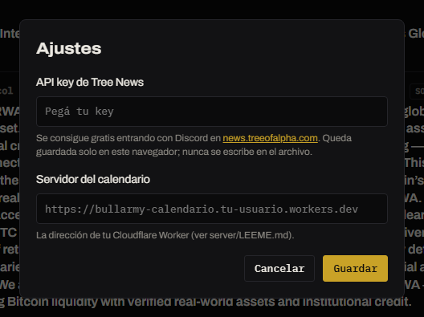

# Ajustes

Se abren con el botón **Ajustes** al pie del menú lateral.

Los dos ajustes son opcionales y solo afectan a la sección [Noticias](../secciones/noticias.md).

| Ajuste | Qué habilita | Cómo conseguirlo |
|---|---|---|
| **API key de Tree News** | Noticias en tiempo real. Sin la key, el feed llega **demorado**. | Gratis: entrá con tu cuenta de Discord en [news.treeofalpha.com](https://news.treeofalpha.com/) y copiá la key. |
| **Servidor del calendario** | El calendario macro de la semana. | La dirección de un servidor propio que devuelva los eventos. Ver [Calendario macro](../como-funciona/calendario-macro.md). |

Tocá **Guardar** y la sección Noticias se reconecta con los datos nuevos.


Los ajustes se guardan **solo en este navegador**. Nunca se escriben en el archivo de la terminal ni se suben al repositorio, así que tu key no queda expuesta si compartís el enlace.


Para borrarlos, dejá el campo vacío y tocá **Guardar**.
