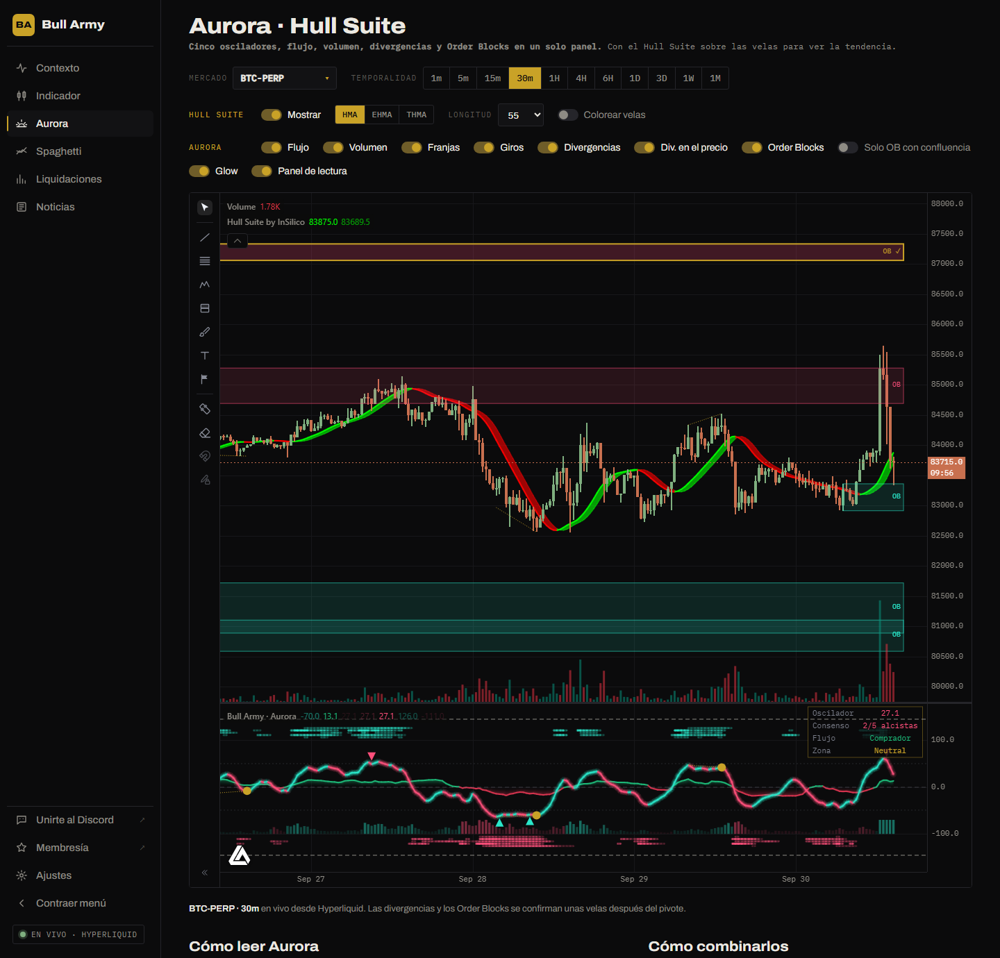
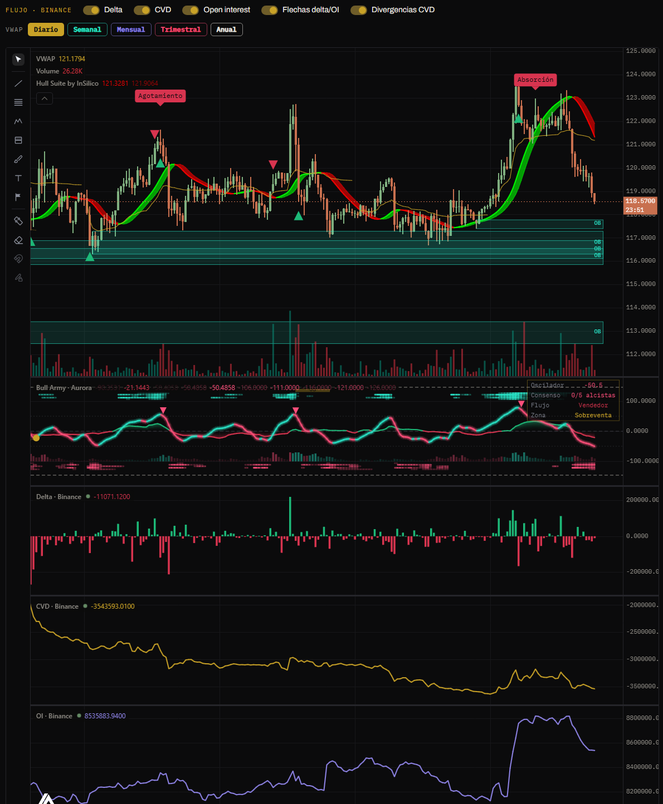

# Aurora

Muestra las velas de cualquier mercado de Hyperliquid con dos indicadores de Bull Army:

- **Aurora**, en un panel debajo del precio: cinco osciladores, flujo de dinero, volumen, divergencias y Order Blocks en una sola lectura.
- **Hull Suite** de InSilico, sobre las velas: la tendencia en verde o rojo.
- **Flujo de Binance**: delta de volumen, CVD y open interest en paneles propios, con flechas y divergencias sobre el precio, y **VWAP** diario, semanal, mensual, trimestral y anual.


Aurora **no da entradas: da contexto.** Ordena la información para responder una pregunta antes de operar: ¿en qué situación está el mercado ahora? La decisión y el riesgo siguen siendo tuyos.


## Controles

### Mercado y temporalidad

Funcionan igual que en la sección [Indicador](indicador.md): el buscador tiene todos los mercados de Hyperliquid (perps, spot y HIP-3), y las temporalidades van de 1 minuto a 1 mes. Aurora arranca en **BTC-PERP de 30 minutos** y recuerda lo último que elegiste, por separado del Indicador.

### Hull Suite

| Control | Qué hace |
|---|---|
| **Mostrar** | Muestra u oculta el Hull sobre las velas. |
| **HMA · EHMA · THMA** | La variante de media de Hull. HMA es la clásica de InSilico. |
| **Longitud** | 21 a 200. **55** para entradas de swing (por defecto); **180–200** como soporte o resistencia dinámica. |
| **Colorear velas** | Pinta las velas del color del Hull. |

### Aurora

| Interruptor | Qué muestra |
|---|---|
| **Flujo** | La línea de flujo de dinero con su relleno. |
| **Volumen** | La banda de volumen relativo en la base del panel. |
| **Franjas** | Las franjas de consenso, una por oscilador. |
| **Giros** | Los triángulos de giro en zona extrema. |
| **Divergencias** | Los puntos dorados y las líneas punteadas en el oscilador. |
| **Div. en el precio** | Las líneas de divergencia también sobre las velas. |
| **Order Blocks** | Las zonas de oferta y demanda sobre el precio. |
| **Solo OB con confluencia** | Oculta los OB que no nacieron en zona extrema. |
| **Glow** | El brillo alrededor de la línea principal. |
| **Panel de lectura** | El cuadro con el resumen del estado actual. |

### Flujo · Binance y VWAP

| Control | Qué muestra |
|---|---|
| **Delta** | Panel con el delta de volumen de cada vela. |
| **CVD** | Panel con el delta acumulado. |
| **Open interest** | Panel con los contratos abiertos. |
| **Flechas delta/OI** | Las flechas verdes y rojas sobre las velas. |
| **Divergencias CVD** | Las etiquetas *Absorción* y *Agotamiento* sobre las velas. |
| **VWAP** | Diario, Semanal, Mensual, Trimestral y Anual: cada botón prende su línea, con su color. |

Todo se explica en [Flujo de Binance](#flujo-de-binance). Los paneles también se pueden cerrar desde la **✕** de su leyenda: el interruptor se apaga solo.

## Cómo se lee

### La línea principal

Es el **promedio de cinco osciladores**: RSI, Estocástico, MFI, CCI y TSI, llevados a una misma escala de −100 a +100 y suavizados. Un oscilador aislado no alcanza para moverla: tiene que haber acuerdo entre varios.

- **Cian** cuando el momentum sube, **rosa** cuando baja. Es dirección, no una orden de compra o venta.
- Las líneas punteadas marcan **+50** (sobrecompra) y **−50** (sobreventa). La discontinua del medio es el **cero**: arriba domina el momentum alcista, abajo el bajista.
- Estar en sobrecompra **no significa** que el precio vaya a caer: en una tendencia fuerte puede quedarse arriba mucho tiempo. Lo que importa es cómo sale de la zona.

### Las franjas de consenso

Cada fila es un oscilador. **Arriba** se enciende cuando ese oscilador está alcista y **abajo** cuando está bajista; cuanto más intenso el color, más extremo el valor.

Si la línea sube pero hay una sola franja encendida, el movimiento es débil. Con **cuatro o cinco encendidas hay consenso real**.

### El flujo de dinero

La línea verde o roja cerca del cero, con relleno. Mide dónde cierra cada vela dentro de su rango, ponderado por el volumen (Chaikin Money Flow):

- **Arriba de cero**: las velas cierran cerca de sus máximos con volumen → presión compradora.
- **Abajo de cero**: presión vendedora.

Su función es **confirmar**. Un rebote con el flujo todavía en rojo es sospechoso.

### El volumen relativo

La banda de columnas en la base del panel. Compara el volumen de cada vela con su promedio: cuanto más opaca, **más volumen que lo normal**. El color acompaña al flujo.

### Cómo combinar flujo y volumen

| Situación | Lectura |
|---|---|
| Precio sube · flujo verde · volumen alto | Movimiento con respaldo: hay compradores reales detrás. |
| Precio sube · flujo rojo | Subida sin compradores fuertes. Desconfiá, sobre todo si llega a una zona de oferta. |
| Precio cae · flujo rojo · volumen alto | Movimiento con respaldo vendedor. |
| Precio cae · flujo verde | Caída sin vendedores fuertes. Puede ser solo un retroceso. |
| Ruptura con volumen apagado | Poca participación: más chances de fallar. |

### Los triángulos

- **Triángulo rosa**: el oscilador se da vuelta hacia abajo estando **por encima de +50**.
- **Triángulo cian**: se da vuelta hacia arriba **por debajo de −50**.

Se confirman una vela después del giro. Son un **aviso de agotamiento**, no una entrada: en una tendencia fuerte vas a ver varios seguidos sin que el precio se dé vuelta.

### Las divergencias

- **Bajista**: el precio hace un máximo más alto y el oscilador uno más bajo.
- **Alcista**: el precio hace un mínimo más bajo y el oscilador uno más alto.

Se marcan con un **punto dorado** en el oscilador y una **línea punteada** en el oscilador y en el precio. Se confirman unas velas después del pivote.


Una divergencia sola nunca es una entrada. La misma divergencia puede funcionar a favor de la estructura y fallar en contra de ella: fijate siempre en la estructura, el flujo y el consenso.


### Los Order Blocks

- **Cómo nacen**: cuando una vela cierra por encima de un máximo de swing (**BOS alcista**), Aurora marca como **OB de demanda** la vela con el mínimo más bajo del tramo anterior. Al revés, un cierre por debajo de un mínimo de swing marca un **OB de oferta** en la vela con el máximo más alto.
- **Confluencia**: si al formarse el OB el oscilador estaba en sobreventa (demanda) o sobrecompra (oferta), la zona nació en un punto de agotamiento real. Se dibuja con **borde dorado**, dice **OB ✓** y aparece una etiqueta dorada en el panel del oscilador.
- **Invalidación**: cuando una vela cierra del otro lado de la zona, el OB se borra. Si ya no está en el gráfico, esa idea dejó de valer.

Un OB con tilde no garantiza la reacción: es una zona para prestar atención y buscar tu confirmación, no una orden límite para dejar puesta.

### El panel de lectura

Arriba a la derecha del panel de Aurora:

| Dato | Qué dice |
|---|---|
| **Oscilador** | El valor actual de la línea principal (−100 a +100). |
| **Consenso** | Cuántos de los cinco osciladores están por encima de cero (por ejemplo, *4/5 alcistas*). |
| **Flujo** | Comprador o vendedor. |
| **Zona** | Sobrecompra, neutral o sobreventa. |

Cuando los datos no coinciden (por ejemplo, momentum bajista con flujo comprador), lo más sano es esperar.

## Con el Hull Suite

El Hull aporta la **estructura de tendencia** que Aurora no mide:

- **Hull verde**: buscá contexto de compra. Priorizá OB de demanda, triángulos cian y divergencias alcistas.
- **Hull rojo**: buscá contexto de venta. Priorizá OB de oferta, triángulos rosas y divergencias bajistas.
- Una señal de Aurora **contra el color del Hull** suele ser solo un retroceso.

## Flujo de Binance

### De dónde salen los datos

Hyperliquid no publica qué parte del volumen fue compra o venta agresiva ni la historia del open interest. Por eso el **delta, el CVD y el open interest** se toman de **Binance Futures**, el mercado con más volumen:

- Aparecen **solo en los mercados que también cotizan en Binance Futures** (BTC, ETH, SOL y la mayoría de los perps). En los demás (HIP-3, spot, listados nuevos) esos paneles no se muestran y la nota debajo del gráfico lo avisa.
- Las velas siguen siendo las de Hyperliquid; el flujo de Binance se acomoda a cada vela.
- El **VWAP** se calcula con las velas de Hyperliquid, así que funciona en **cualquier mercado**.

### Los paneles

| Panel | Qué muestra |
|---|---|
| **Delta** | Compras agresivas menos ventas agresivas de cada vela (en la moneda del mercado). Verde: dominaron las compras; rojo: las ventas. |
| **CVD** | El delta acumulado. Si sube, dominan los compradores agresivos; si baja, los vendedores. Importa **su dirección**, no el número. |
| **Open interest** | Contratos abiertos al cierre de cada vela. Sube: entran posiciones nuevas. Baja: se cierran posiciones. |

### Las flechas

Se marcan en velas **cerradas** con **más del doble del volumen promedio** de las 20 anteriores:

| Flecha | Condición | Lectura |
|---|---|---|
| 🟢 **Verde** (debajo de la vela) | Delta **negativo** y open interest que **sube** | Venta agresiva que abre shorts con mucho volumen. Si el precio no cae, esos shorts quedan atrapados. |
| 🔴 **Roja** (encima de la vela) | Delta **positivo** y open interest que **baja** | La compra viene de shorts que cierran, no de longs nuevos. Suba sin compradores reales detrás. |

### Las divergencias del CVD

Comparan dos giros seguidos del precio con el CVD en esos mismos giros. Se marcan **solo cuando Aurora está en su extremo**: en sobrecompra (+50) para las bajistas y en sobreventa (−50) para las alcistas. Las demás se omiten.

| Etiqueta | Precio | CVD | Lectura |
|---|---|---|---|
| 🔴 **Absorción** (arriba) | Máximo más bajo | Máximo más alto | Los compradores empujan y el precio no sube: alguien vende contra ellos. |
| 🔴 **Agotamiento** (arriba) | Máximo más alto | Máximo más bajo | La suba sigue, pero con menos compradores agresivos. |
| 🟢 **Absorción** (abajo) | Mínimo más alto | Mínimo más bajo | Los vendedores empujan y el precio no baja: alguien compra contra ellos. |
| 🟢 **Agotamiento** (abajo) | Mínimo más bajo | Mínimo más alto | La caída sigue, pero con menos vendedores agresivos. |

Pasá el mouse sobre una etiqueta para ver su explicación.


**Nada se repinta.** Las flechas y las divergencias usan solo velas cerradas. Una divergencia necesita **3 velas cerradas después del giro** para confirmarlo: aparece con ese atraso, en la vela del giro, y una vez dibujada no se mueve ni desaparece.


### Los VWAP

El precio promedio ponderado por volumen desde el inicio del **día, semana (lunes), mes, trimestre o año**, en hora UTC. Funcionan como imanes y como soporte o resistencia: el precio arriba del VWAP muestra control comprador en ese período; abajo, vendedor. Un VWAP solo aparece en temporalidades más cortas que su período (el diario no se muestra en velas de 1 día).

### Límites

- En **1 minuto** Binance no da open interest por vela: la línea usa los datos de 5 minutos y **no hay flechas**.
- Binance guarda el open interest de los **últimos 30 días**: en temporalidades altas, las velas más viejas no tienen OI ni flechas.
- Las velas de 3 días y 1 semana de Binance no coinciden con las de Hyperliquid: se arman sumando velas diarias.

## Checklist para operar

Leelo de arriba hacia abajo. Cuantos más puntos se cumplen, más sólido es el escenario. Si faltan la estructura o la zona, no hay operación.

| | Compra | Venta |
|---|---|---|
| **Estructura** | Tendencia alcista en la temporalidad mayor (Hull verde) o BOS alcista reciente. | Tendencia bajista en la temporalidad mayor (Hull rojo) o BOS bajista reciente. |
| **Zona** | El precio vuelve a un OB de demanda, mejor con confluencia. | El precio vuelve a un OB de oferta, mejor con confluencia. |
| **Oscilador** | En sobreventa o saliendo de ella. Triángulo cian o divergencia alcista. | En sobrecompra o saliendo de ella. Triángulo rosa o divergencia bajista. |
| **Consenso** | Se apagan las franjas de abajo y se encienden las de arriba. | Se apagan las de arriba y se encienden las de abajo. |
| **Confirmación** | El flujo pasa a verde y el volumen se enciende en el rebote. | El flujo pasa a rojo y el volumen acompaña la caída. |
| **Gatillo** | Tu confirmación de estructura, por ejemplo un CHoCH alcista en temporalidad menor. | Tu confirmación de estructura, por ejemplo un CHoCH bajista en temporalidad menor. |
| **Stop** | Debajo del OB de demanda. | Arriba del OB de oferta. |
| **Se invalida** | Una vela cierra debajo del OB y Aurora lo borra. | Una vela cierra arriba del OB y Aurora lo borra. |

**El orden importa**: primero la estructura, después la zona, después el oscilador. El oscilador confirma lo que ya ves en el precio, nunca al revés.

## Cuándo quedarse afuera

| Situación | Por qué |
|---|---|
| **Contexto mixto** | El consenso dice una cosa y el flujo otra. Esperá a que se alineen. |
| **Mercado sin dirección** | Oscilador pegado al cero y franjas apagadas. No hay nada que leer. |
| **Señal contra la estructura** | Un triángulo cian en plena tendencia bajista suele ser un rebote, no un cambio. |
| **Señal lejos de una zona** | Una divergencia o un triángulo sin un OB cerca es solo un aviso. |
| **Vela abierta** | Las marcas pueden aparecer y desaparecer hasta que la vela cierra. Decidí con la vela cerrada. |
