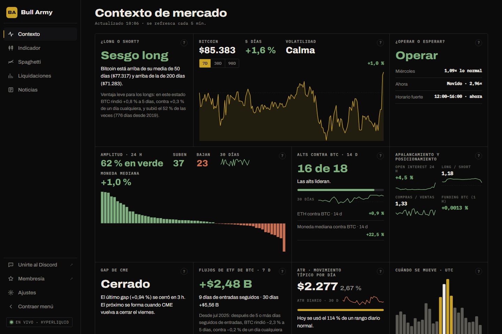

# Contexto

Es la pantalla de inicio. Responde una pregunta: **¿en qué mercado estoy parado hoy?**

Los datos se actualizan **cada 5 minutos** mientras la sección está abierta. Cada tarjeta tiene un botón **?** con un resumen de lo que mide.

## ¿Long o short?

El sesgo de fondo de Bitcoin según sus medias móviles de 50 y 200 días.

| Estado | Condición |
|---|---|
| **Sesgo long** | El cierre diario de BTC está **arriba** de la media de 50 **y** de la de 200. |
| **Sesgo short** | Está **abajo** de ambas. |
| **Neutral** | Está entre las dos. |

**La estadística de abajo** recorre todos los días desde 2019 en los que BTC estuvo en ese mismo estado y mide qué pasó **5 días después**: el rendimiento promedio, el porcentaje de veces que subió y cuántos casos hay. Lo compara con el promedio de un día cualquiera, para que veas si el estado actual da ventaja real o no.

## Bitcoin

- **Precio** de BTC en Hyperliquid.
- **5 días**: variación del cierre diario contra el de hace 5 días.
- **Volatilidad**: compara la volatilidad de los **últimos 7 días** con la del último año.
  - Se calcula como el desvío de los retornos diarios de 7 días, anualizado.
  - Si está en el 35 % más bajo del año: **Calma**. En el 25 % más alto: **Agitada**. En el medio: **Normal**.
- **Gráfico** de 7, 30 o 90 días, con la variación del período arriba a la derecha.

## ¿Operar o esperar?

Mide si BTC **se está moviendo lo suficiente** como para que valga la pena operar.

| Fila | Cómo se calcula |
|---|---|
| **Hoy** (día de la semana) | Rango medio de este día de la semana en el último año, contra el rango medio de todos los días. `1,09×` = un 9 % más movido que un día promedio. |
| **Ahora** | Rango de la última hora cerrada contra el promedio de esa misma hora en los últimos 30 días. |
| **Horario fuerte (UTC)** | Las 4 horas seguidas que más se mueven en promedio en los últimos 30 días. Indica si estás adentro (*ahora*) o cuánto falta. |

**El veredicto** es **Operar** cuando el día viene al menos al 85 % de lo normal **y** además se cumple una de estas:

- estás dentro del horario fuerte,
- la hora actual se mueve al menos al 70 % de lo normal, o
- el horario fuerte empieza en menos de 3 horas.

Si no, dice **Esperar**.

## Amplitud · 24 h

Cuántas monedas acompañan al mercado.

- Toma los **60 perps de Hyperliquid con más volumen** en 24 h y calcula su cambio de 24 h.
- **% en verde**, cuántas **suben** y cuántas **bajan**, y el cambio de la **moneda mediana**.
- El gráfico de barras las ordena de la que más sube a la que más baja; pasá el mouse para ver cada una.
- **30 días**: la línea muestra, día por día, qué parte de las monedas principales cerró en verde.

## Alts contra BTC · 14 d

¿Conviene estar en alts o en BTC?

- Toma las **20 monedas con más volumen** y compara su rendimiento de 14 días con el de BTC.
- **"15 de 18"** = 15 de las 18 monedas con datos rindieron más que BTC en 14 días.
- La barra muestra esa proporción y la línea de **30 días**, cómo evolucionó.
- Abajo: **ETH contra BTC** y la **moneda mediana contra BTC**, ambos a 14 días.

## Apalancamiento y posicionamiento

Qué están haciendo los traders con futuros de BTC. Datos de **Binance Futures** (BTCUSDT, últimas 24 horas, en velas de 1 hora):

| Dato | Qué indica |
|---|---|
| **Open interest 24 h** | Cuánto creció o bajó el dinero apalancado. Sube con precio subiendo: entra dinero nuevo long. |
| **Long / short** | Relación entre cuentas long y cuentas short. Mayor a 1: hay más cuentas long. |
| **Compras / ventas** | Relación entre compras agresivas (a mercado) y ventas agresivas. Mayor a 1: dominan los compradores. |
| **Funding BTC (1 h)** | Tasa de financiamiento horaria de BTC en Hyperliquid. Positiva: los longs le pagan a los shorts. |

## Gap de CME

Los futuros de Bitcoin de CME cierran el **viernes a las 16:00** (hora de Chicago) y reabren el **domingo a las 17:00**. La diferencia entre ambos precios es el "gap", que muchos traders esperan que el precio vuelva a cerrar.

- La terminal lo **aproxima** con el precio de BTC en Hyperliquid a esas horas. **No son los precios del futuro de CME.**
- Un gap se considera **cerrado** cuando alguna vela posterior toca el precio del cierre del viernes. Se informa en cuántas horas se cerró.
- La tabla muestra los últimos gaps de las 8 semanas anteriores.

## Flujos de ETF de BTC · 7 d

Entradas y salidas netas diarias de los **ETF spot de Bitcoin de EE.UU.**, según SoSoValue.

- El número grande es la suma de los últimos 7 días. Abajo, la racha actual (días seguidos de entradas o de salidas) y la suma de 30 días.
- **La estadística** busca los días en que se venía de **5 o más días seguidos de entradas** y mide qué hizo BTC en los 5 días siguientes, contra un día cualquiera.

## ATR · movimiento típico por día

El **ATR** (Average True Range) de 14 períodos: cuánto se mueve BTC en una vela típica.

- El número grande es el **ATR diario**, en dólares y en porcentaje del precio.
- La barra dorada muestra **qué parte del rango diario normal ya se usó hoy** (rango de hoy ÷ ATR diario). Más del 100 %: hoy ya se movió más que un día típico.
- Abajo, el ATR de **4 horas** y de **1 hora**, útiles para dimensionar stops en temporalidades cortas.

## Cuándo se mueve · UTC

Rango medio de cada hora del día (UTC) en los últimos 30 días. En **dorado**, el horario fuerte; **resaltada**, la hora actual. Sirve para saber a qué hora conviene estar frente a la pantalla.
