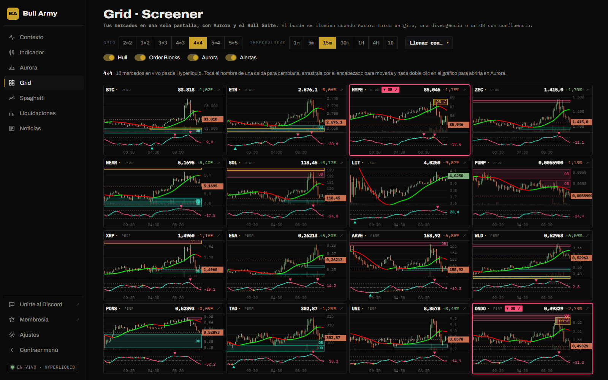
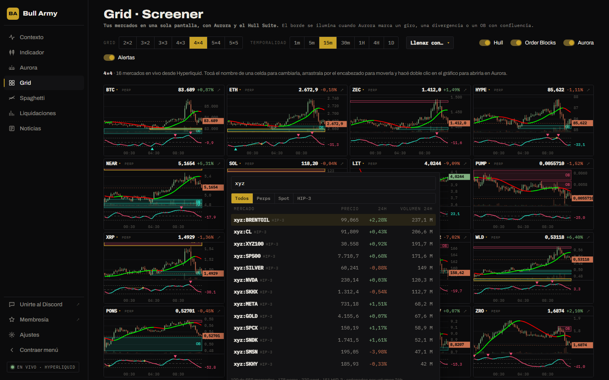

# Grid

Un screener para seguir **de 4 a 25 mercados a la vez** en una sola pantalla. Cada celda muestra las velas en vivo con el **Hull Suite**, los **Order Blocks** y el **mini oscilador de Aurora**. Cuando Aurora marca algo, el borde de la celda se ilumina, así que ves de un vistazo dónde mirar.

## La barra de arriba

| Control | Qué hace |
|---|---|
| **Grid** | El tamaño de la grilla: 2×2, 3×2, 3×3, 4×3, 4×4, 5×4 o 5×5. |
| **Temporalidad** | La misma para todas las celdas: 1m, 5m, 15m, 30m, 1H, 4H o 1D. |
| **Llenar con…** | Arma el grid al instante con una lista automática (ver abajo). |
| **Hull** | Muestra u oculta la línea del Hull Suite (HMA 55). |
| **Order Blocks** | Muestra u oculta las zonas de oferta y demanda. |
| **Aurora** | Muestra u oculta el mini oscilador de cada celda. |
| **Alertas** | Enciende o apaga el borde iluminado y la etiqueta de señal. |

Todo se guarda en tu navegador: al volver, encontrás el mismo grid.

## Elegir los activos

### Una celda por vez

Tocá el **nombre** del activo en el encabezado de cualquier celda. Se abre el buscador con **todos los mercados de Hyperliquid**: perps, spot y HIP-3. Escribí para filtrar, movete con las flechas y confirmá con **Enter**.

Si el activo que elegís ya estaba en otra celda, las dos celdas **intercambian lugares**: no quedan repetidos.

### Todo el grid de una vez

**Llenar con…** reemplaza la lista completa:

| Opción | Arma el grid con |
|---|---|
| **Top volumen · Perps** | Los perpetuos con más volumen en 24 h. |
| **Top volumen · HIP-3** | Los mercados HIP-3 (acciones, materias primas, índices) con más volumen. |
| **Top volumen · Spot** | Los pares spot con más volumen. |
| **Más movidos 24 h** | Entre los 120 mercados con más volumen, los que más se movieron (para arriba o para abajo). |
| **Mayores subas 24 h** | Entre esos 120, los que más subieron. |
| **Mayores bajas 24 h** | Entre esos 120, los que más bajaron. |

Si te arrepentiste, tocá **Deshacer** en el aviso que aparece abajo (dura 8 segundos) y vuelve tu lista anterior.

### Ordenar

Arrastrá una celda **desde su encabezado** y soltala sobre otra: intercambian lugares.


La lista guarda hasta 25 activos. Si pasás de 5×5 a 2×2, se muestran los primeros 4, pero el resto no se pierde: al volver a 5×5 reaparecen en su lugar.


## Leer una celda

**Encabezado**: nombre del activo (tocalo para cambiarlo), tipo de mercado (perp, spot o hip-3), etiqueta de señal si hay una, precio y variación de 24 h. El botón **↗** abre ese activo en la sección [Aurora](aurora.md).

**Panel de precio**:

- **Velas** con el volumen tenue en la base.
- **Hull Suite**: línea verde cuando sube, roja cuando baja.
- **Order Blocks** activos: cian los de demanda, rosa los de oferta. Con **borde dorado** y **OB ✓** los que tienen confluencia.
- **Precio actual**: línea punteada y etiqueta en el eje.

**Mini oscilador de Aurora** (abajo):

- La línea de Aurora, **cian** cuando sube y **rosa** cuando baja, con el valor actual a la derecha.
- Líneas punteadas en **+50** y **−50**, y el **cero** discontinuo.
- **Triángulos**: giros en zona extrema.
- **Puntos y líneas doradas**: divergencias.

Pasá el mouse sobre el gráfico para ver la fecha, el cierre, la variación de la vela y el valor de Aurora en ese punto. Con **doble clic** se abre en la sección Aurora.

Cómo interpretar cada elemento de Aurora: ver [Aurora › Cómo se lee](aurora.md).

## Alertas visuales

Cuando Aurora marca una de estas señales en las **últimas 3 velas**, el borde de la celda se ilumina y aparece una etiqueta en el encabezado:

| Etiqueta | Señal | Borde |
|---|---|---|
| **▲ Giro** | Giro alcista del oscilador bajo −50. | Cian |
| **▼ Giro** | Giro bajista del oscilador sobre +50. | Rosa |
| **▲ Div.** | Divergencia alcista confirmada. | Cian |
| **▼ Div.** | Divergencia bajista confirmada. | Rosa |
| **▲ OB ✓** | Nuevo OB de demanda con confluencia. | Cian |
| **▼ OB ✓** | Nuevo OB de oferta con confluencia. | Rosa |

El número al lado (por ejemplo **2v**) indica hace cuántas velas ocurrió; sin número, es en la vela actual. Pasá el mouse sobre la etiqueta para ver el detalle.


Una señal en la **vela actual** puede desaparecer si la vela cierra distinto. Las alertas son para saber **dónde mirar**, no para entrar: abrí el activo en Aurora y seguí el [checklist](aurora.md).


## Bueno saber

- Cada celda muestra hasta las últimas **150 velas**, según su ancho.
- Aurora y el Hull son los **mismos** que en la sección [Aurora](aurora.md): los valores, las señales y los Order Blocks coinciden.
- Las velas se actualizan **en vivo**.
- Si dejás la pestaña en segundo plano más de un minuto, al volver se recarga todo para no perder datos.
- El Grid necesita conexión en vivo: en [modo demo](../modo-demo.md) muestra un aviso.

## Consejos

- **2×2 o 3×2** para seguir de cerca pocos activos con más detalle. **5×5** para barrer muchos mercados y detectar dónde hay señal.
- En temporalidades bajas (1m, 5m) las señales aparecen y desaparecen rápido: usá 15m o más para filtrar ruido.
- Combiná **Más movidos 24 h** con las alertas: te muestra dónde hay movimiento y cuáles de esos tienen agotamiento según Aurora.
