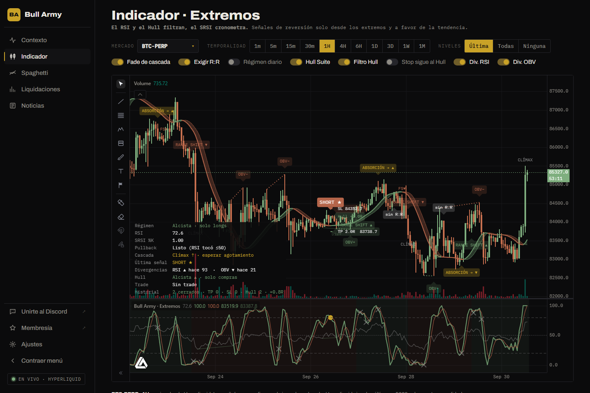
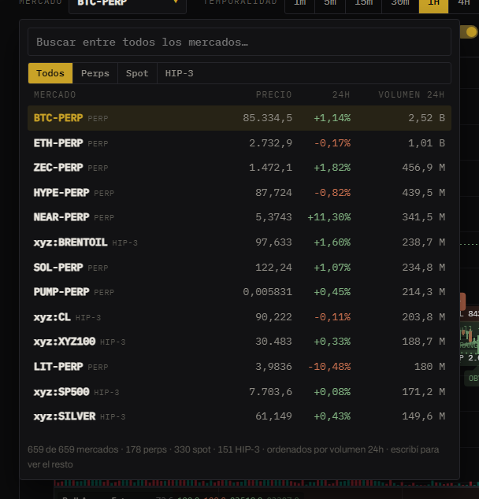

# Indicador

Muestra el gráfico de cualquier mercado de Hyperliquid con el indicador **Extremos** aplicado. Es el mismo Pine Script que se usa en TradingView, ejecutado dentro del navegador.


Para entender las señales, leé primero [La regla en cuatro pasos](../indicador-extremos/la-regla.md) y [Cómo leer el gráfico](../indicador-extremos/como-leer-el-grafico.md).


## Elegir el mercado

Tocá el botón **Mercado** (arriba a la izquierda) para abrir el buscador.

- Incluye **todos** los mercados de Hyperliquid, ordenados por volumen de 24 h:
  - **Perps**: futuros perpetuos (BTC-PERP, ETH-PERP…).
  - **Spot**: pares al contado (HYPE/USDC…).
  - **HIP-3**: perpetuos de mercados creados por terceros.
- Escribí para filtrar y movete con las flechas; **Enter** elige.
- La terminal recuerda el último mercado elegido.

## Temporalidad

De **1 minuto** a **1 mes**: 1m, 5m, 15m, 30m, 1H, 4H, 6H, 1D, 3D, 1W y 1M.

Hyperliquid entrega hasta unas **5000 velas** por temporalidad, así que en temporalidades cortas el historial es más corto. El gráfico se actualiza en vivo y **las señales se confirman al cierre de cada vela**.

## Niveles

Qué niveles de entrada, stop y objetivo se dibujan:

- **Última**: solo los del último trade (recomendado para operar).
- **Todas**: los de todos los trades del historial (útil para estudiar el comportamiento).
- **Ninguna**: gráfico limpio.

## Interruptores

Cada interruptor cambia una opción del Pine Script y el gráfico se recalcula al instante.

| Interruptor | Encendido | Por defecto |
|---|---|---|
| **Fade de cascada** | Muestra las señales FADE después de una cascada de liquidaciones agotada. | Sí |
| **Exigir R:R** | Descarta los gatillos donde el extremo previo está más cerca que el objetivo (se marcan *sin R:R*). | Sí |
| **Régimen diario** | Toma el régimen del RSI desde la temporalidad diaria en lugar de la del gráfico. | No |
| **Hull Suite** | Dibuja el Hull Suite sobre el precio. | Sí |
| **Filtro Hull** | Solo permite señales a favor del Hull. | Sí |
| **Stop sigue al Hull** | El stop acompaña a la banda del Hull en vez de quedar fijo. | No |
| **Div. RSI** | Marca divergencias del RSI. | Sí |
| **Div. OBV** | Marca divergencias del OBV (volumen). | Sí |


**Régimen diario** no está disponible en **6H** ni en **3D**: el motor que ejecuta Pine en el navegador no puede pedir datos de otra temporalidad en esas dos. El interruptor se desactiva solo.


## Cuánto tarda

Al abrir la sección o cambiar de mercado aparece *Ejecutando el Pine Script…*. El cálculo sobre miles de velas tarda **entre 5 y 15 segundos** según la computadora. Mientras tanto la página sigue respondiendo: el script corre en segundo plano.

## Herramientas del gráfico

La barra de la izquierda del gráfico tiene herramientas de dibujo (líneas, rectángulos, Fibonacci, etc.). Con la rueda del mouse hacés zoom y arrastrando te movés en el tiempo.
