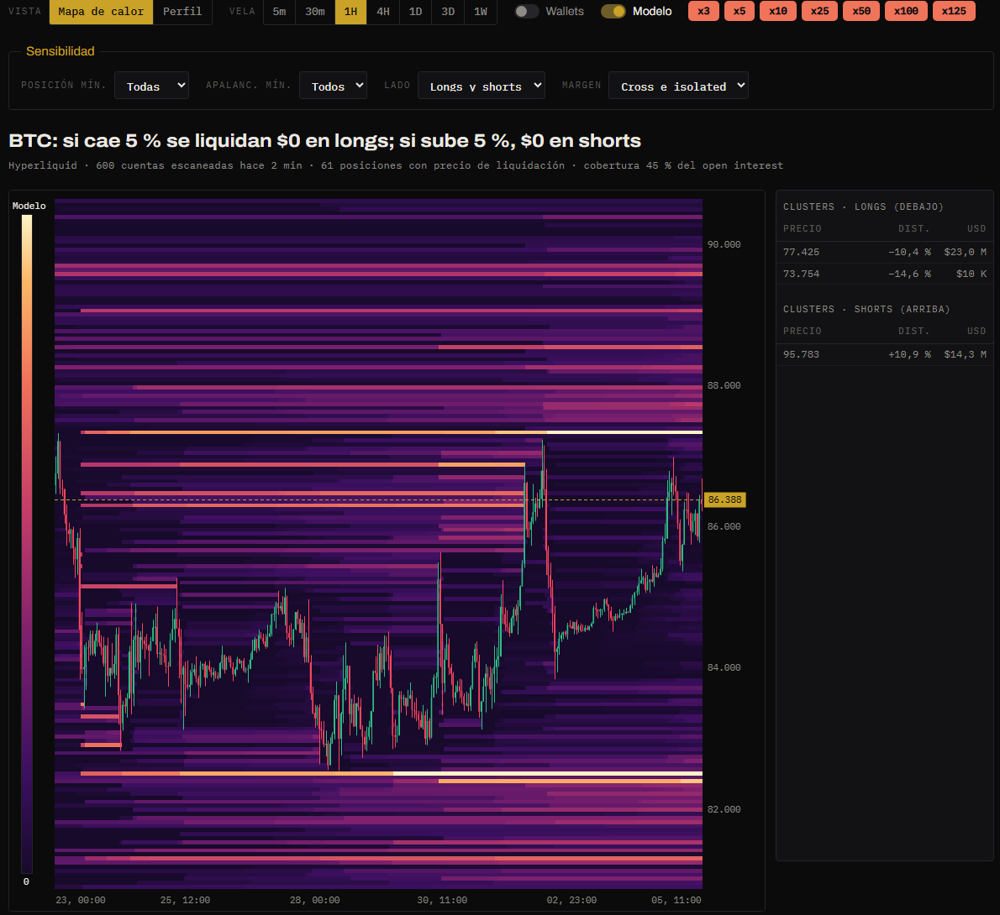
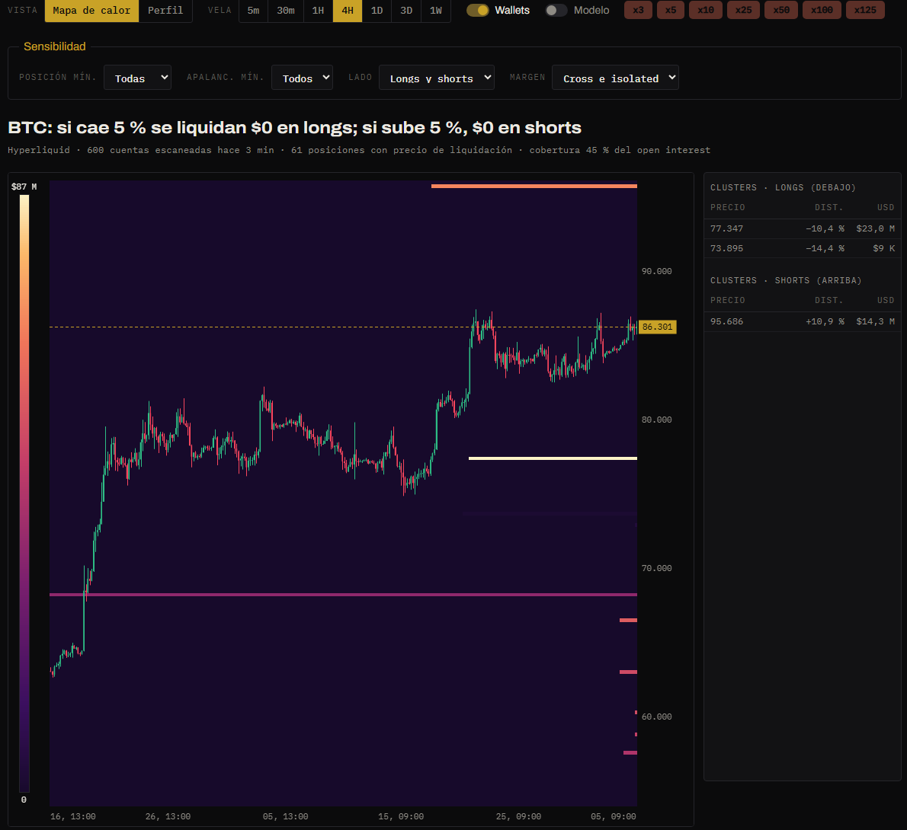
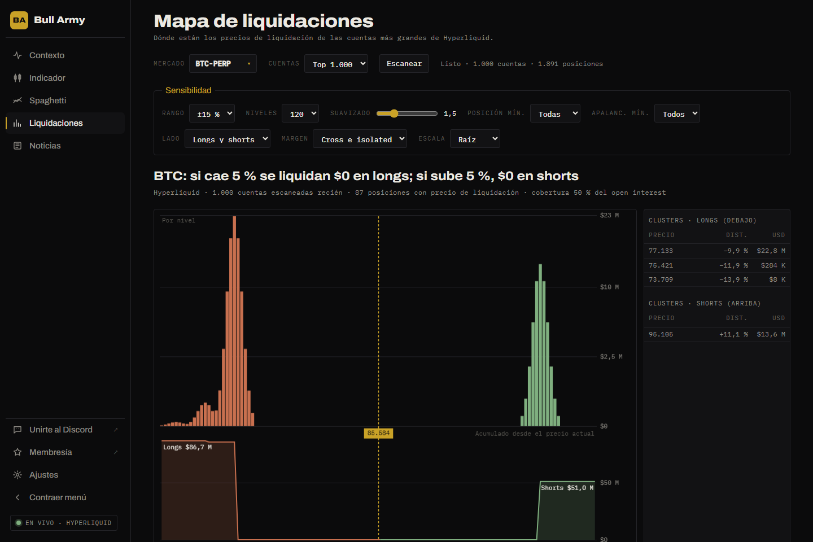

# Liquidaciones

Muestra **a qué precios se liquidarían** las posiciones apalancadas. Las zonas con muchas liquidaciones suelen funcionar como imanes: cuando el precio llega, las liquidaciones en cadena aceleran el movimiento.



## Las posiciones de las wallets

Las posiciones de las **5000 cuentas más grandes** de Hyperliquid se escanean **automáticamente cada hora** en el servidor, así que al abrir la sección ya están cargadas. Arriba se indica cuándo fue el último escaneo.

- **Reescanear en vivo** repite el escaneo desde tu navegador para tener lo último. Tarda varios minutos (Hyperliquid limita los pedidos) y podés elegir cuántas cuentas: Top 500 a Top 5.000.
- El buscador de **Mercado** muestra el open interest y la **cobertura**: qué parte de ese open interest está en las cuentas escaneadas.

## Mapa de calor (vista por defecto)

Precio en el eje vertical, tiempo en el horizontal y las velas encima, como en Coinglass. Cada franja de color es un precio donde hay liquidaciones: **cuanto más clara** (de violeta a amarillo), **más dinero se liquidaría ahí**. La escala de la izquierda muestra el máximo.

| Control | Qué hace |
|---|---|
| **Vela** | 5m, 30m, 1H, 4H, 1D, 3D o 1W. Se ven las últimas 300 velas (en 5m, un día). |
| **Wallets** | Las posiciones reales de las cuentas escaneadas. |
| **Modelo** | Liquidaciones estimadas a partir del volumen, con los apalancamientos que elijas: **x3, x5, x10, x25, x50, x100 y x125**. |

### Wallets

Cada posición abierta es una franja en su **precio de liquidación**. Arranca en la **última vela que pasó por su precio de entrada**, que es una apertura estimada (Hyperliquid no informa cuándo se abrió), y sigue hasta hoy, porque la posición sigue abierta.



Las cuentas grandes suelen usar poco apalancamiento, así que sus liquidaciones quedan lejos del precio: en velas chicas (5m) pueden no entrar en el rango. Probá **1H o 4H**.

### Modelo x3 a x125

Calcula liquidaciones **sin depender de las wallets**, para cualquier mercado:

1. Toma cada vela con **volumen por encima del promedio de las 20 anteriores**: ahí se asume que entró gente.
2. Desde su **máximo** y su **mínimo**, calcula dónde se liquidaría un long y un short con cada apalancamiento:
   - long: entrada × (1 − 1/apalancamiento + 0,4 %)
   - short: entrada × (1 + 1/apalancamiento − 0,4 %)
3. Cada franja pesa según el volumen que superó el promedio, **nace en esa vela y se apaga cuando el precio la toca**: esas posiciones ya se liquidaron.

Con las dos capas prendidas, cada una se mide en su propia escala y se muestra la mayor.


El 0,4 % es un margen de mantenimiento típico. Con x125, la liquidación queda a solo 0,4 % de la entrada, por eso esas franjas aparecen pegadas al precio y se apagan rápido.


## Perfil

La vista **Perfil** muestra lo mismo de las wallets, pero acumulado en el presente: cuánto se liquidaría en cada nivel de precio.



### Leer el perfil

Arriba del mapa, un titular resume lo más importante: **cuánto se liquidaría si el precio cae o sube un 5 %**. Debajo, cuántas cuentas y posiciones se usaron y la cobertura del open interest.

- **Longs** (naranja): sus liquidaciones están **debajo** del precio actual. Si el precio baja hasta ahí, esos longs se liquidan y venden.
- **Shorts** (verde): sus liquidaciones están **arriba**. Si el precio sube, se liquidan y compran.
- La **altura** de cada barra es cuántos dólares se liquidarían en ese nivel.
- El área **acumulada** muestra cuánto se liquidaría en total si el precio fuera desde el actual hasta ese nivel.
- Pasá el mouse por el mapa para ver el detalle de cada nivel.

A la derecha, dos tablas con los **5 clusters más grandes** de cada lado: precio, distancia al precio actual y USD. Tocá una fila para ubicarla en el mapa.

## Sensibilidad y filtros

**Posición mín.**, **Apalanc. mín.**, **Lado** y **Margen** filtran las wallets en las dos vistas. El resto solo aplica al Perfil.

| Control | Qué hace |
|---|---|
| **Rango** | Qué tan lejos del precio actual mirar: ±5 % a ±50 %. |
| **Niveles** | En cuántas franjas de precio se divide el rango (60 a 300). Más niveles = más detalle. |
| **Suavizado** | Reparte cada nivel entre sus vecinos para que se vean zonas en vez de picos sueltos. |
| **Posición mín.** | Ignora posiciones más chicas que ese tamaño ($10 K a $10 M). |
| **Apalanc. mín.** | Solo posiciones con al menos ese apalancamiento (3x a 20x). |
| **Lado** | Longs y shorts, solo longs o solo shorts. |
| **Margen** | Cross, isolated o ambos. |
| **Escala** | **Lineal** o **Raíz**. La raíz achica los picos gigantes para que se vean también los niveles chicos. |

## Cómo se calcula

1. **Cuentas**: del ranking público de Hyperliquid se toman las 5000 con mayor valor de cuenta (el servidor lo hace cada hora; con Reescanear en vivo, las N que elijas).
2. **Posiciones**: para cada cuenta se consulta su estado (`clearinghouseState`), que incluye el **precio de liquidación** que calcula Hyperliquid para cada posición abierta.
3. **Mapa**: el rango de precio se divide en niveles y cada posición suma su tamaño en dólares al nivel de su precio de liquidación. Se descartan las posiciones que ya deberían estar liquidadas (un long con precio de liquidación por encima del precio actual, por ejemplo).
4. **Suavizado**: se aplica un filtro gaussiano sobre los niveles.
5. **Clusters**: los máximos locales del mapa suavizado, ordenados por tamaño.

Para referencia, la fórmula oficial de Hyperliquid es:

```
precio_liq = precio − lado × margen_disponible / |tamaño| / (1 − l × lado)
l = 1 / apalancamiento_de_mantenimiento
lado = 1 para long, −1 para short
```


El mapa **no incluye el 100 % de las posiciones**, solo las de las cuentas escaneadas. Por eso la cobertura importa: con cobertura baja, el mapa es una muestra, no la foto completa.

