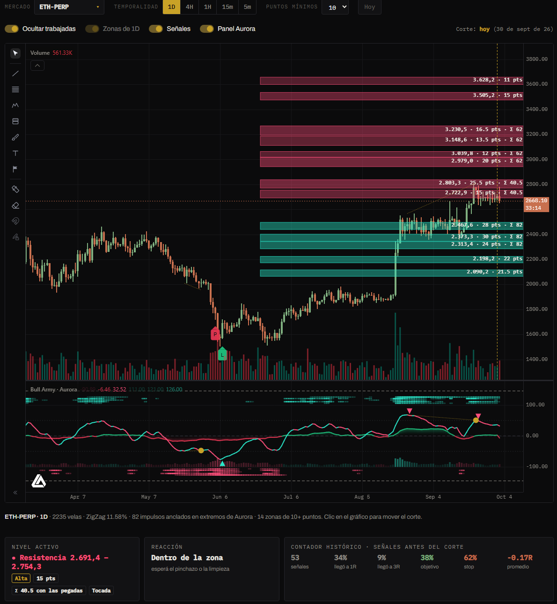
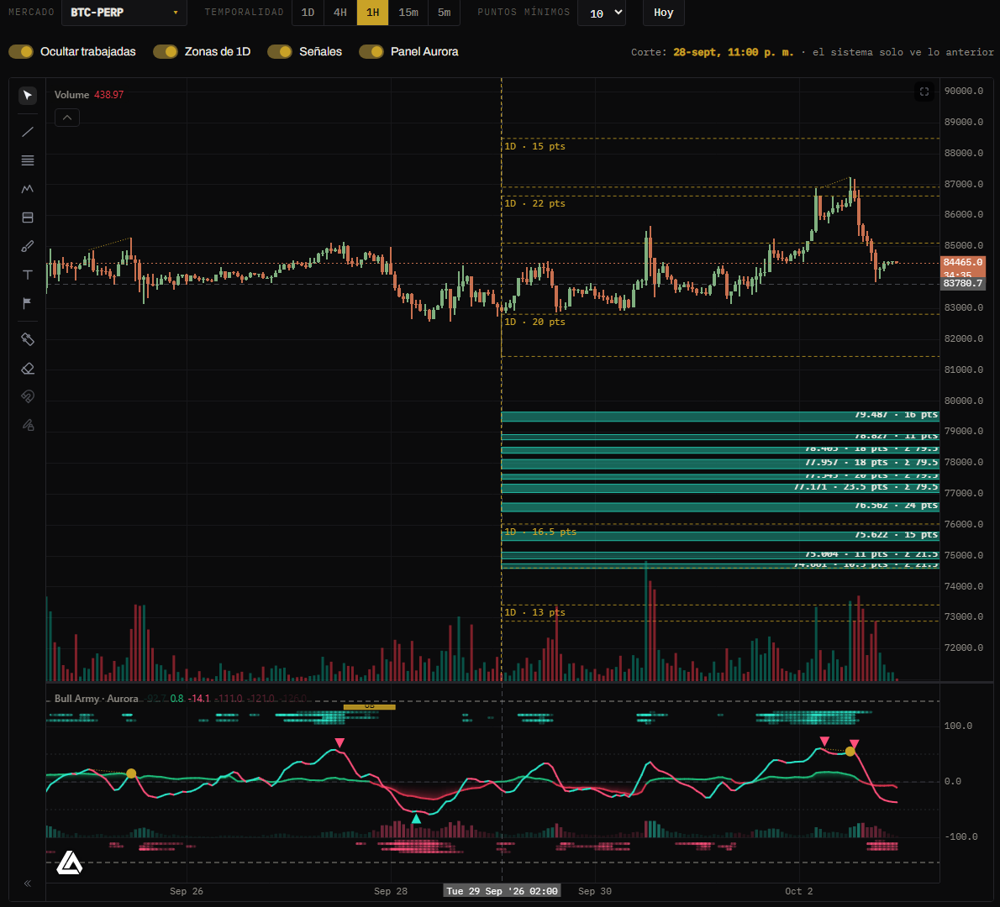

# Niveles

Marca las **zonas donde se juntan muchos niveles de Fibonacci**. Cada zona tiene **puntos**: cuantos más niveles caen en ella, más fuerte es. Solo se usan los impulsos que **terminaron con Aurora en un extremo**, es decir en sobrecompra o sobreventa. El resto se descarta.


Una zona **no dice que el precio va a girar ahí.** Dice que, *si* gira ahí, el recorrido suele ser interesante y el stop chico. Antes de operar, mirá el **contador histórico** de ese mercado.


## Cómo se arman las zonas

1. **Impulsos:** se detectan los tramos del precio con un ZigZag, ajustado a la volatilidad de cada mercado. Un impulso existe recién en la vela que lo **confirma**: el sistema nunca mira el futuro.
2. **Filtro Aurora:** solo cuentan los impulsos cuyo **pivote final** se formó con el oscilador de Aurora en **+50 o más** (máximos) o en **−50 o menos** (mínimos). Son los giros de agotamiento.
3. **Competencia:** se quedan los 25 impulsos más relevantes, según su **tamaño** y lo **recientes** que sean.
4. **Fibonacci:** de cada impulso se proyectan sus niveles. Valen 3 puntos el 0.618 y el 1.618; 2 puntos el 0.382, 0.714, 0.905, 1.097 y 1.382; 1 punto o medio el resto.
5. **Zonas:** los niveles cercanos se agrupan. Los **puntos** de la zona son la suma de sus niveles.

## Controles

| Control | Qué hace |
|---|---|
| **Mercado** | Cualquier mercado de Hyperliquid: perps, spot o HIP-3. |
| **Temporalidad** | 1D, 4H, 1H, 15m o 5m. Usa hasta 5000 velas de historia. |
| **Puntos mínimos** | 6, 8, 10 (por defecto), 12 o 15. Con menos puntos aparecen más zonas, pero más débiles. |
| **Hoy** | Vuelve la línea de corte al presente. |
| **Ocultar trabajadas** | Oculta las zonas que el precio ya superó. |
| **Zonas de 1D** | En temporalidades chicas, suma las zonas diarias en **dorado punteado**. |
| **Señales** | Muestra u oculta las marcas P y L. |
| **Panel Aurora** | El oscilador debajo del precio, para ver los extremos. |

## La línea de corte

La **línea dorada vertical** es la fecha de análisis. El sistema calcula las zonas **solo con lo que sabía hasta ahí**, y las dibuja hacia la derecha para que veas cómo reaccionó el precio después.

- **Clic en el gráfico:** mueve el corte a esa vela.
- **Flechas ← →:** lo mueven una vela; con **Shift**, diez.
- **Hoy:** lo vuelve al presente.

Cuanto más cerca está el corte de lo que querés analizar, más impulsos conoce el sistema y más precisas son las zonas.

## Cómo se leen

| Elemento | Qué indica |
|---|---|
| **Zona verde** | Soporte: queda debajo del precio al corte. |
| **Zona roja** | Resistencia: queda arriba. |
| **Zona gris** | Trabajada: el precio ya la superó. |
| **"11 pts"** | Los puntos de la zona. Más puntos en menos ancho = zona más fuerte. |
| **"Σ 22"** | Bandas **pegadas**: sus puntos se suman. El precio que limpia dos bandas juntas limpia toda esa confluencia. |
| **Dorado punteado "1D"** | Zona de la temporalidad diaria. |

Debajo del gráfico:

- **Nivel activo:** la zona más cercana, con su rango, puntos, fuerza (**Alta** de 12 pts, **Media** de 8 pts) y estado.
- **Reacción:** la distancia a la zona, o cuánto se alejó el precio desde que la tocó.
- **Contador histórico:** cómo les fue a las señales anteriores en ese mercado y temporalidad.
- **Tablas** de zonas al corte y últimas señales.

## Las señales

| Marca | Señal | Stop |
|---|---|---|
| **P** · Pinchazo | El precio toca la zona y cierra afuera, del lado del que venía. | Detrás de la mecha. |
| **L** · Limpieza | El precio atraviesa la zona entera, cierra del otro lado y vuelve a entrar. | Detrás del extremo del barrido. |

- **Objetivo:** la zona opuesta más cercana. Si no hay, 3 veces el riesgo (3R).
- **Una señal por zona:** la de su **primera visita** después de formarse.
- **Colores:** 🟢 llegó al objetivo · 🔴 tocó el stop · 🟡 todavía abierta.
- Pasá el mouse sobre la marca para ver la entrada, el stop, el objetivo y el resultado. Las señales abiertas muestran sus tres líneas.

### El contador histórico

Para cada mercado y temporalidad cuenta las señales anteriores al corte:

- cuántas **llegaron a 1R** y a **3R** a favor antes del stop;
- cuántas alcanzaron el **objetivo** y cuántas tocaron el **stop**;
- el **resultado promedio en R**.


**Los números son honestos.** Si en una vela tocan el stop y el objetivo a la vez, cuenta como stop. Las señales usan solo las zonas que existían en ese momento. En muchos mercados el promedio queda cerca de 0R: la zona sola no alcanza. Combinala con [Aurora](aurora.md), el Hull Suite y las zonas de 1D, y elegí los mercados donde el contador acompaña.


## Cómo usarlo

1. Mirá las zonas en **1D** o **4H** para saber dónde están las confluencias grandes.
2. Bajá a **15m** o **5m** con **Zonas de 1D** prendido: las entradas en zonas que coinciden con una diaria son las más sólidas.
3. Esperá un **pinchazo** o una **limpieza** y poné el stop donde indica la señal.
4. Si hay varias zonas seguidas a favor, no cierres en la primera: suelen limpiarse juntas.
