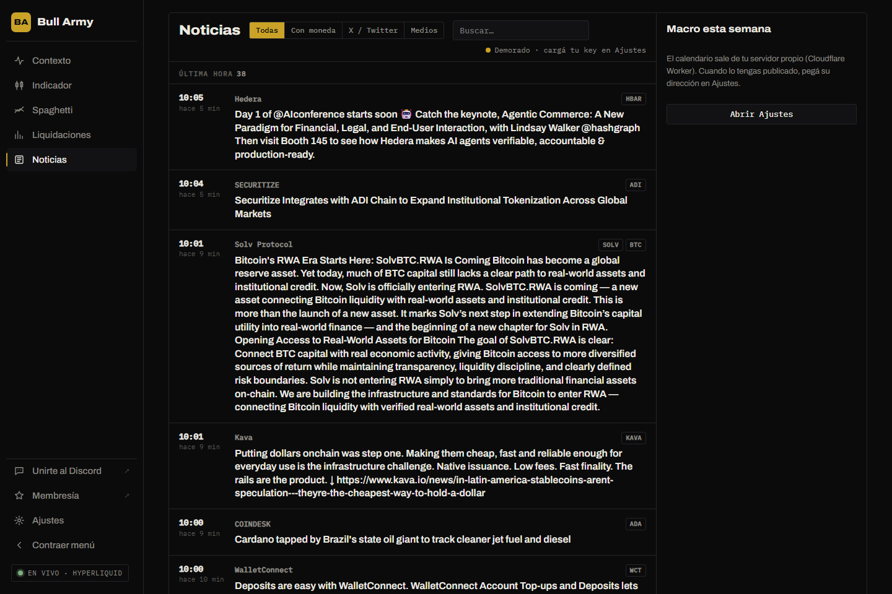

# Noticias

## Feed de noticias

Las noticias vienen de [Tree News](https://news.treeofalpha.com/), un agregador muy usado por traders de cripto: medios, cuentas de X/Twitter, anuncios de exchanges y documentos regulatorios.

- Al abrir la sección se cargan las últimas 200 noticias, agrupadas en **Última hora**, **Antes hoy**, **Ayer** y **Más viejas**.
- Las nuevas entran solas arriba y aparecen **resaltadas** unos segundos.
- Cada noticia muestra la hora, la fuente y las monedas mencionadas. Tocá el título para abrir la nota original.

**Filtros:**

| Filtro | Muestra |
|---|---|
| **Todas** | Todo el feed. |
| **Con moneda** | Solo noticias que mencionan alguna moneda. |
| **X / Twitter** | Solo publicaciones de X. |
| **Medios** | Solo medios y otras fuentes. |

El buscador filtra por título, fuente o moneda.

### Estado de la conexión

Arriba a la derecha:

| Estado | Significado |
|---|---|
| 🟢 **En vivo · se actualiza cada minuto** | Modo gratis, sin configurar nada: la terminal consulta Tree News cada minuto. Las noticias llegan con 1–2 minutos de demora. |
| 🟢 **En vivo · al instante** | Con tu key de Tree News cargada en [Ajustes](../primeros-pasos/ajustes.md) (opcional): llegan en el momento. |
| 🟡 **Key inválida · se usa la versión gratis** | La key no funcionó; la terminal sigue con el modo gratis. |
| 🔴 **Sin conexión · reintentando** | No se pudo consultar Tree News; reintenta cada minuto. |

## Macro esta semana

El panel de la derecha muestra los datos económicos de **EE.UU.** de impacto **alto** y **medio** de la semana (inflación, empleo, tasas…):

- **Próximo dato fuerte**: cuenta regresiva al próximo evento de impacto alto, con el pronóstico y el dato anterior.
- **Lista de la semana**, agrupada por día: hora, evento y cuánto falta. Los de impacto alto llevan un punto rojo.

Funciona solo, sin configurar nada. Los datos vienen de ForexFactory y se renuevan cada hora; al pie se ve la hora de la última actualización. Ver [Calendario macro](../como-funciona/calendario-macro.md).
