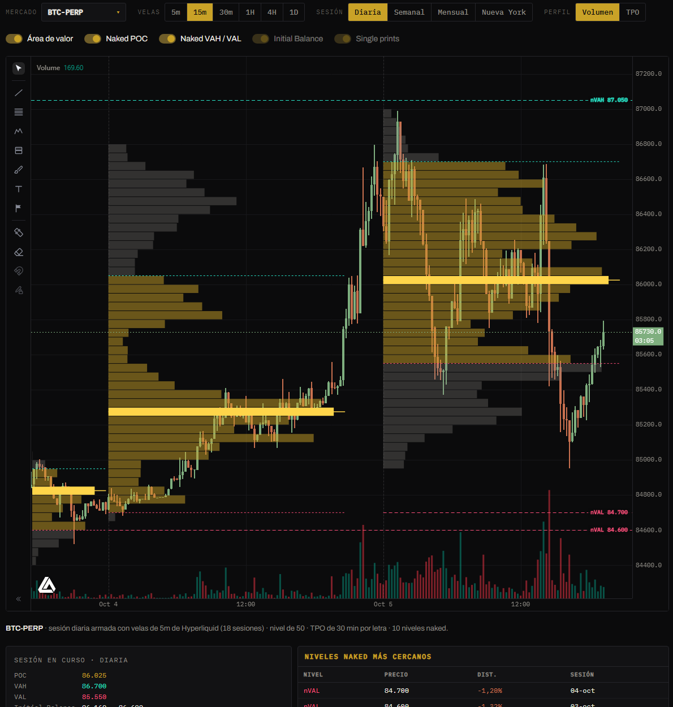
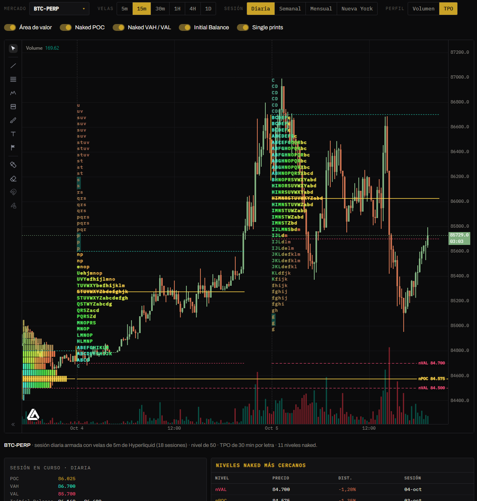

# Orderflow

Muestra **dónde se operó más volumen** (Volume Profile) o **dónde pasó más tiempo el precio** (TPO, Market Profile) en cada sesión, directamente sobre el gráfico de velas. De cada sesión marca su **POC** y su **área de valor**. Los niveles que el precio **todavía no volvió a tocar** quedan como **naked**, extendidos hacia la derecha.

## Controles

| Control | Qué hace |
|---|---|
| **Mercado** | Cualquier mercado de Hyperliquid: perps, spot o HIP-3. |
| **Velas** | La temporalidad del gráfico: 5m, 15m, 30m, 1H, 4H o 1D. |
| **Sesión** | Cómo se corta cada perfil: **Diaria** (00:00 UTC), **Semanal** (lunes a domingo), **Mensual** o **Nueva York** (9:30 a 16:00, la sesión de las acciones). |
| **Perfil** | **Volumen** (Volume Profile) o **TPO** (letras). |
| **Área de valor** | Resalta el 70 % central del perfil y dibuja sus bordes, VAH y VAL. |
| **Naked POC** · **Naked VAH / VAL** | Los niveles de sesiones pasadas que el precio todavía no tocó. |
| **Initial Balance** · **Single prints** | Solo en TPO: el rango de la primera hora y los niveles con una sola letra. |

El gráfico es el mismo de Aurora: zoom, paneo y herramientas de dibujo. Los perfiles siguen el movimiento del gráfico.

## Cómo se lee

| Elemento | Qué indica |
|---|---|
| **Barras del perfil** | Cuánto volumen (o cuántos períodos, en TPO) hubo en cada nivel de precio de la sesión. |
| **POC** (amarillo) | *Point of Control*: el nivel con más volumen o más tiempo. Es el "precio justo" de la sesión. |
| **Área de valor** (dorado) | Donde se concentró el 70 % de la actividad. **VAH** (cian) es su borde de arriba y **VAL** (rosa) el de abajo. |
| **Naked** (líneas hasta la derecha) | POC, VAH o VAL de una sesión terminada que el precio no volvió a tocar. Suelen funcionar como **imán**: el precio tiende a volver a buscarlos. Desaparecen cuando el precio los toca. |

## TPO (Market Profile)

Cada **letra** es un período de la sesión: **A** es el primero, **B** el segundo, y así sigue. En cada nivel de precio aparecen las letras de los períodos en que el precio pasó por ahí. Las letras van de **cian** (las primeras de la sesión) a **rosa** (las últimas).

| Sesión | Cada letra es |
|---|---|
| Diaria y Nueva York | 30 minutos |
| Semanal | 4 horas |
| Mensual | 1 día |

- **Initial Balance** (barra dorada a la izquierda): el rango de los primeros períodos, la primera hora en la sesión diaria. Si el precio sale de ahí con fuerza, suele marcar la dirección del día.
- **Single prints** (fondo cian): niveles con **una sola letra**, por donde el precio pasó rápido. Son zonas débiles que muchas veces se vuelven a rellenar.
- Si el zoom no deja espacio para leer las letras, se dibujan como bloques de color.

Debajo del gráfico, la **sesión en curso** y la **anterior**:
- POC, VAH, VAL e Initial Balance;
- **forma** del perfil: **P**, compradores arriba; **b**, vendedores abajo; **D**, equilibrio;
- cantidad de single prints y **extremos débiles**: un máximo o un mínimo con varias letras, que suele no ser un techo o un piso firme.

A la derecha, los **niveles naked más cercanos** al precio, con su distancia y la sesión de la que vienen.

## De dónde salen los datos

- **Velas de Hyperliquid:** de 5m para las sesiones diarias y de Nueva York (unos 17 días de historia), de 1h para las semanales y de 4h para las mensuales.
- **TPO:** es **exacto**, porque solo usa el rango de precio de cada período.
- **Volume Profile:** es una **muy buena aproximación**. El volumen de cada vela se reparte en los niveles que cubrió, porque Hyperliquid no publica el historial de cada operación.
- **Actualización:** la sesión en curso se actualiza en vivo.


**Cómo usarlo:** los naked POC cercanos son objetivos naturales del precio. Si el precio está fuera del área de valor de la sesión anterior y vuelve a entrar, suele recorrerla hasta el otro borde. Combinalo con [Niveles](niveles.md) y [Aurora](aurora.md).

