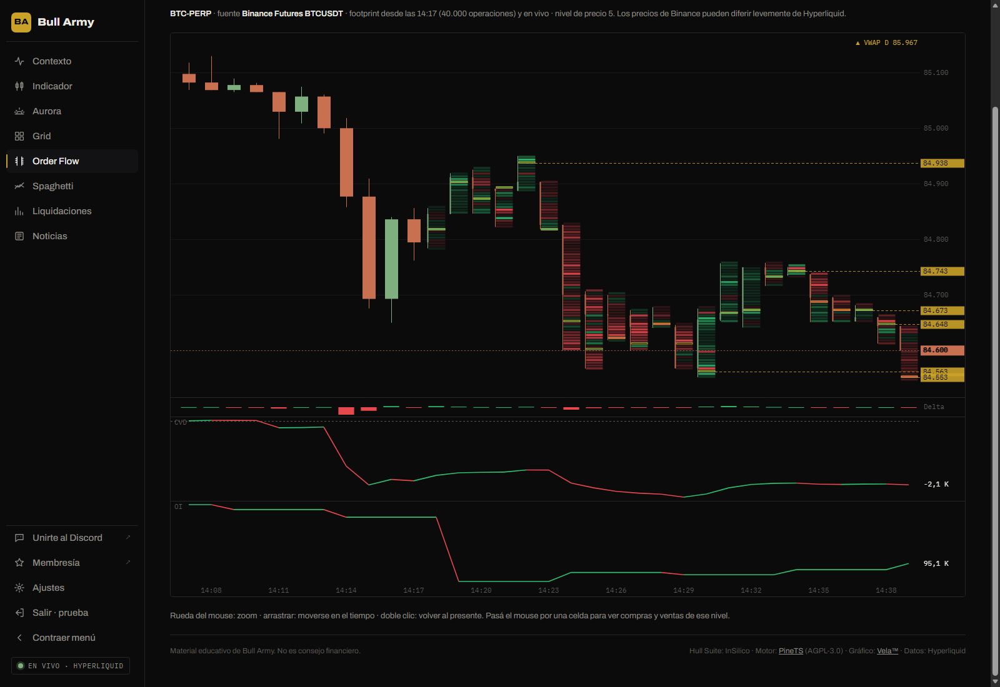
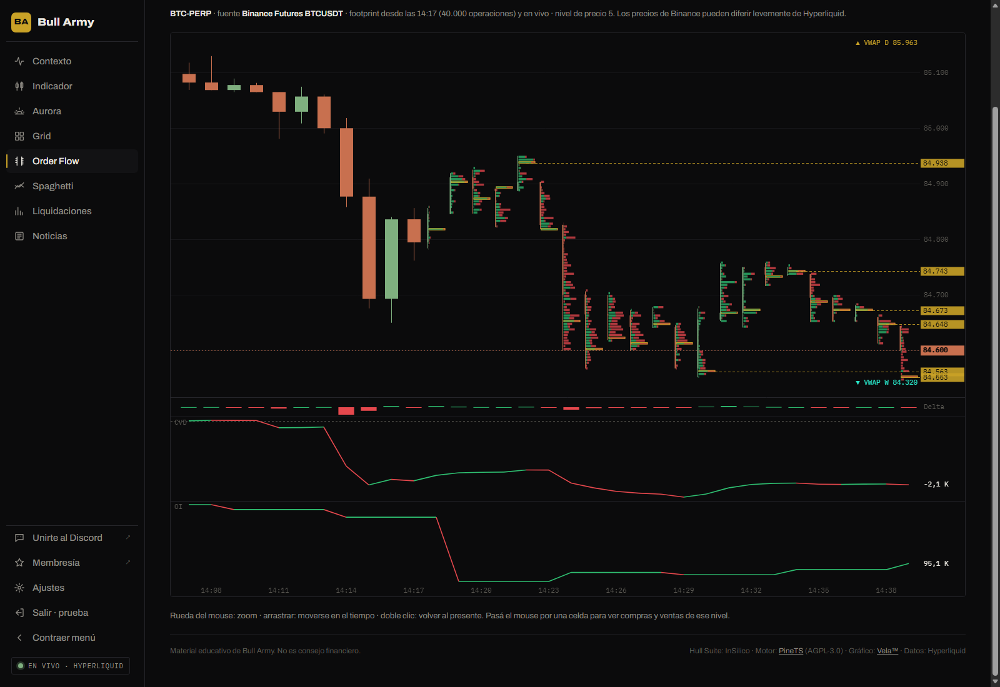

# Order Flow

Muestra **dónde se compró y se vendió agresivamente dentro de cada vela**. Cada vela se divide en niveles de precio y cada nivel se colorea según quién dominó: compradores o vendedores. Debajo, el **delta**, el **CVD** y el **open interest**.

## De dónde salen los datos

| Mercado | Fuente | Qué tenés |
|---|---|---|
| **Los que cotizan en Binance Futures** (BTC, ETH, SOL y la mayoría de los perps) | Binance Futures | Footprint de los **últimos ~20 minutos o más** (según cuánto opere el mercado) y en vivo. CVD y open interest **con historia**. |
| **Los que solo están en Hyperliquid** (HIP-3, spot, listados nuevos) | Hyperliquid | Footprint y CVD **en vivo desde que abrís la sección**: Hyperliquid no publica el historial de operaciones. Open interest en vivo. |

Arriba del gráfico se indica la fuente, desde qué hora hay footprint y el **nivel de precio** (el tamaño de cada celda).


Con fuente Binance, los precios pueden diferir **levemente** de los de Hyperliquid: son mercados distintos. El flujo de órdenes de Binance, por su volumen, suele anticipar lo que pasa en el resto.


## Controles

- **Mercado** y **temporalidad**: de 1 minuto a 1 hora (el footprint tiene sentido en temporalidades cortas).
- **Footprint**:
  - **Mapa de delta**: cada nivel en **verde** si dominaron las compras agresivas y en **rojo** si dominaron las ventas; cuanto más intenso, mayor la diferencia.
  - **Perfil de volumen**: barras horizontales por nivel con el volumen comprado (verde) y vendido (rojo).
- **Naked POC**, **CVD** y **Open interest**: se muestran u ocultan.
- **VWAP**: diario, semanal, mensual, trimestral y anual, cada uno con su color. Si un VWAP queda fuera de la pantalla, aparece en el borde con una flecha y su valor.

**En el gráfico**: rueda del mouse para acercar o alejar, arrastrar para moverse en el tiempo y **doble clic** para volver al presente. Pasá el mouse por una celda para ver las compras, las ventas y el delta de ese nivel.

## Cómo se lee

| Elemento | Qué muestra |
|---|---|
| **Celda verde / roja** | Delta del nivel: compras agresivas menos ventas agresivas. |
| **Borde dorado** | El **POC** de la vela: el nivel con más volumen. |
| **Línea punteada dorada** | **Naked POC**: el POC de una vela al que el precio **todavía no volvió**. Funciona como imán o como zona de reacción; desaparece cuando el precio lo toca. Su precio se ve en el eje. |
| **Delta** (barras bajo el precio) | Compras menos ventas agresivas de cada vela. |
| **CVD** | El delta acumulado: si sube, dominan los compradores agresivos; si baja, los vendedores. |
| **Open interest** | Contratos abiertos. Sube con precio subiendo: entra dinero nuevo long. Baja: se cierran posiciones. |
| **VWAP** | Precio promedio ponderado por volumen desde el inicio del día, la semana, el mes, el trimestre o el año (UTC). |

## Lecturas útiles

| Situación | Lectura |
|---|---|
| Precio sube y **CVD baja** | La suba no tiene compradores agresivos detrás: divergencia, posible agotamiento. |
| Precio cae, **CVD plano** y **OI baja** | Se están cerrando longs, no hay venta agresiva nueva. |
| Precio sube con **CVD y OI subiendo** | Movimiento con respaldo: entran compradores nuevos. |
| Celdas rojas intensas en el **máximo** de una vela que cierra abajo | Vendedores absorbiendo la suba. |
| Precio llega a un **naked POC** | Zona donde suele haber reacción; mirá el delta al tocarlo. |


La primera vela con datos suele estar incompleta (la historia empieza a mitad de esa vela): se muestra como vela normal y no cuenta para los naked POC.

