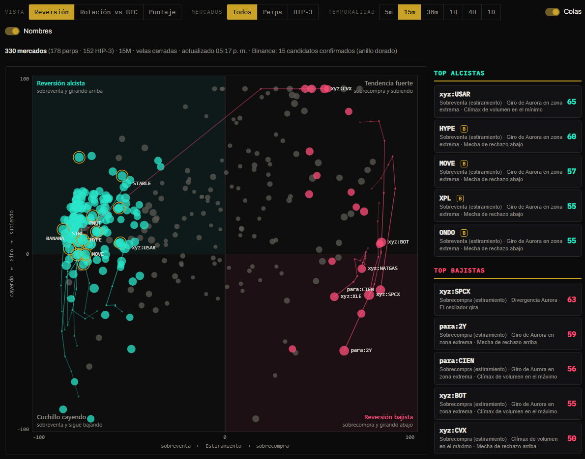
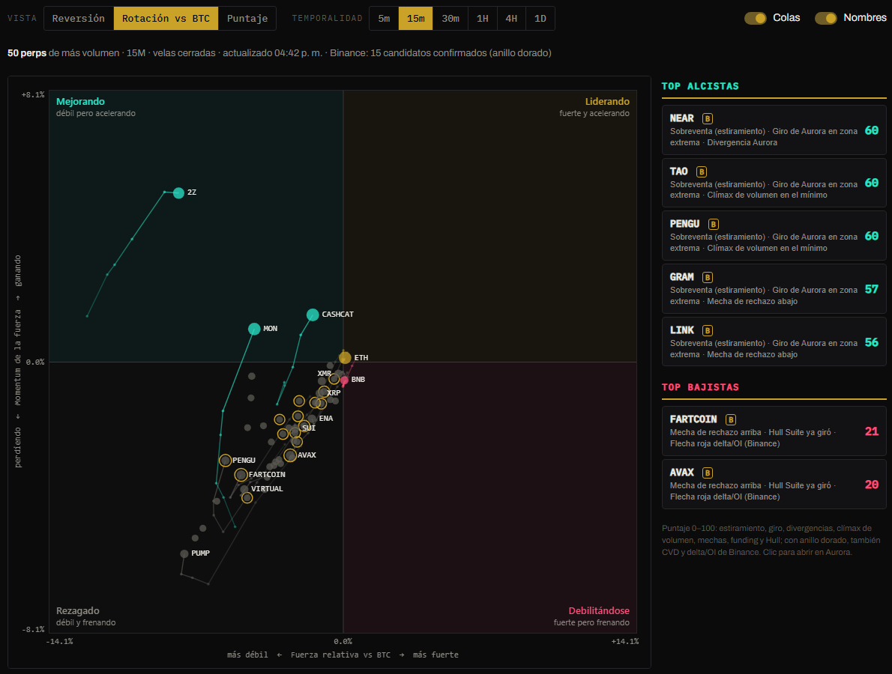
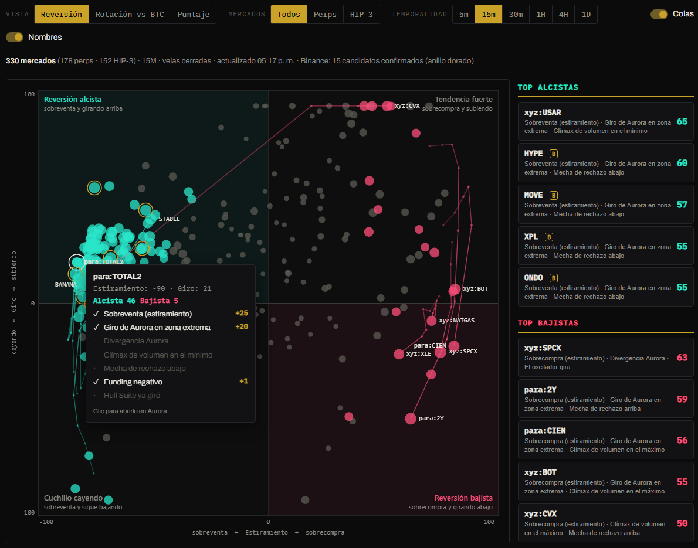

# Scanner

Ubica **todos los perps de crypto y los mercados HIP-3 de Hyperliquid** (más de 300) en un plano cartesiano. Cada punto es un mercado y su posición responde dos preguntas: **¿qué tan estirado está?** y **¿ya empezó a girar?** Los mejores candidatos a reversión quedan en dos esquinas.


El Scanner **no da entradas: muestra dónde mirar.** Hacé clic en un punto para abrir ese mercado en [Aurora](aurora.md) y confirmar ahí.


## Controles

| Control | Qué hace |
|---|---|
| **Vista** | Reversión, Rotación vs BTC o Puntaje: tres formas de leer el mismo grupo de mercados. |
| **Mercados** | **Todos**, solo **Perps** de crypto o solo **HIP-3** (acciones, índices, materias primas y otros mercados de los dex HIP-3). |
| **Temporalidad** | 5m, 15m, 30m, 1H, 4H o 1D. |
| **Colas** | El recorrido de las últimas 5 velas cerradas de los mejores candidatos. |
| **Nombres** | Los nombres de los mejores candidatos sobre el plano. |

Pasá el mouse sobre un punto para ver su detalle, con un checklist de qué cumplió. El clic, sobre el punto o en la lista de la derecha, lo abre en Aurora con la misma temporalidad. El Scanner recuerda la vista y la temporalidad que elegiste.

## Las tres vistas

### Reversión

| Eje | Qué mide |
|---|---|
| **Estiramiento** (horizontal) | A la izquierda, sobreventa; a la derecha, sobrecompra. Combina el oscilador de Aurora con la distancia del precio a su media de 50 velas, medida en ATR. |
| **Giro** (vertical) | Si el oscilador de Aurora ya está subiendo (arriba) o bajando (abajo) en las últimas 3 velas. |

| Cuadrante | Lectura |
|---|---|
| 🟢 **Reversión alcista** (arriba a la izquierda) | Sobreventa que **empieza a girar arriba**. Los mejores candidatos alcistas. |
| 🔴 **Reversión bajista** (abajo a la derecha) | Sobrecompra que **empieza a girar abajo**. Los mejores candidatos bajistas. |
| **Cuchillo cayendo** (abajo a la izquierda) | Sobreventa que **sigue bajando**: todavía no hay giro. Esperar. |
| **Tendencia fuerte** (arriba a la derecha) | Sobrecompra que **sigue subiendo**: no ir en contra. |

La **cola** dice hacia dónde va: un punto que viene de *Cuchillo cayendo* y entra a *Reversión alcista* está girando. Uno que hace el camino inverso, está perdiendo el rebote.

### Rotación vs BTC

Al estilo de los gráficos de rotación (RRG): compara cada mercado **contra BTC**.

| Eje | Qué mide |
|---|---|
| **Fuerza relativa** (horizontal) | Cuánto rinde contra BTC respecto de su promedio de 20 velas. |
| **Momentum** (vertical) | Si esa fuerza relativa está creciendo o achicándose. |

Los mercados suelen rotar **en sentido horario**: *Mejorando* (cian) → *Liderando* (dorado) → *Debilitándose* (rosa) → *Rezagado* (gris). Los que entran a **Mejorando** son los que empiezan a ganarle a BTC.

### Puntaje

El puntaje alcista en el eje horizontal y el bajista en el vertical. Abajo a la derecha quedan los mercados con **solo señales alcistas**; arriba a la izquierda, los que tienen **solo señales bajistas**; arriba a la derecha, señales de los dos lados (mejor no tocar).

## El puntaje

Cada mercado tiene un puntaje alcista y otro bajista, de 0 a 100. El tamaño del punto es el puntaje del lado al que se inclina.

| Condición | Puntos | Alcista | Bajista |
|---|---|---|---|
| Estiramiento | hasta 25 | Sobreventa | Sobrecompra |
| Giro | hasta 20 | Aurora marcó un giro en zona extrema o el oscilador sube desde abajo | Lo mismo, hacia abajo |
| Divergencia de Aurora | 15 | Alcista en las últimas 10 velas | Bajista |
| Clímax de volumen | 10 | Más de 2× el volumen promedio en el mínimo de 10 velas (capitulación) | En el máximo |
| Mecha de rechazo | 10 | Mecha inferior de más de la mitad de la vela | Mecha superior |
| Funding | hasta 5 | Negativo: los shorts pagan, combustible para un rebote | Alto |
| Hull Suite | 5 | Ya giró al alza | Ya giró a la baja |
| Divergencia del CVD (Binance) | 10 | Absorción o agotamiento alcista | Bajista |
| Flecha delta/OI (Binance) | 5 | Verde | Roja |

Las dos condiciones de Binance se revisan para los **15 mejores candidatos** que también cotizan en Binance Futures. Se marcan con un **anillo dorado** en el plano y una **B** en la lista. Ver [Flujo de Binance](aurora.md#flujo-de-binance).

A la derecha, **Top alcistas** y **Top bajistas** muestran los 5 mejores de cada lado con sus tres motivos principales.


**Nada se repinta.** Todo se calcula con **velas cerradas** y se actualiza solo cuando cierra cada vela.


## La primera carga

Hyperliquid permite pedir el historial de unos **45 mercados por minuto**, así que la primera carga completa tarda **unos 7 minutos** con *Todos* (unos 4 con *Perps* y 3 con *HIP-3*). Para que sea útil desde el principio:

- Los mercados se cargan **de mayor a menor volumen**: los más líquidos aparecen en el primer minuto.
- Arriba del plano se ve el avance y cuánto falta.
- Si salís del Scanner, la carga **se pausa** para no frenar el resto de la terminal, y sigue cuando volvés.
- Una vez cargado, se mantiene al día en vivo: volver al Scanner o cambiar entre *Todos*, *Perps* y *HIP-3* es instantáneo. Cambiar la **temporalidad** sí vuelve a cargar todo.

## Cómo usarlo

1. Elegí la temporalidad en la que operás.
2. En **Reversión**, mirá las dos esquinas de color y las colas que **entran** en ellas.
3. Revisá en la lista de la derecha los puntajes más altos y sus motivos. Con anillo dorado hay además confirmación de Binance.
4. Hacé clic para abrirlo en Aurora y confirmá con el Hull Suite y los Order Blocks.
5. Si el mercado está en **Cuchillo cayendo**, esperá a que la cola suba antes de pensar en comprar.
