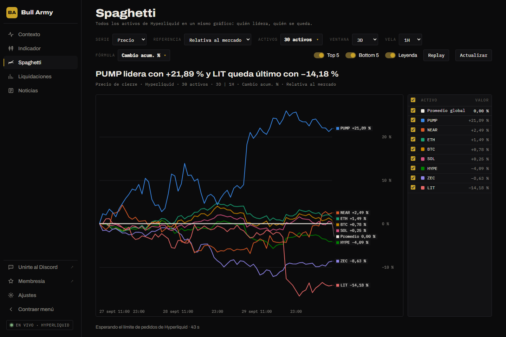

# Spaghetti

Pone muchos activos en un mismo gráfico, normalizados para que se puedan comparar aunque valgan distinto. Así se ve de un vistazo **quién lidera y quién se queda atrás**.

## Controles

### Serie

- **Precio**: compara cómo se mueven los precios.
- **Volumen**: compara la actividad.

Con **Precio**, la última vela se actualiza en tiempo real.

### Referencia

Contra qué se mide cada activo:

| Opción | Qué muestra |
|---|---|
| **Absoluta** | El valor de cada activo tal cual. |
| **Relativa al mercado** | Cada activo **menos el promedio** de todos los elegidos. Arriba de 0: le gana al grupo. |
| **Relativa a BTC** | Cada activo **menos BTC**. Arriba de 0: le gana a Bitcoin. |

### Activos

Tocá el botón para elegir qué activos ver:

- Atajos **Top 10 / 20 / 30 / 50** (por volumen) y **Ninguno**.
- Filtros **Perps**, **HIP-3**, **Spot** o **Todos**.
- Buscador para agregar o quitar uno por uno.

Se pueden mostrar hasta **80 activos** a la vez.

### Ventana y vela

- **Ventana**: el período que se ve, de **6 horas a 1 año**.
- **Vela**: la resolución, de **1 minuto a 1 día**.

Solo se habilitan combinaciones que den entre 12 y 1500 puntos en el gráfico (por ejemplo, 1 año en velas de 1 minuto no se puede).

### Fórmula

Cómo se transforma cada serie:

| Fórmula | Cálculo |
|---|---|
| **Estándar** | El valor crudo. |
| **Cambio acumulado** | Valor actual − valor al inicio de la ventana. |
| **Cambio acumulado (%)** | Cuánto subió o bajó en % desde el inicio de la ventana. **La más usada para comparar.** |
| **Cambio** | Valor actual − valor de la vela anterior. |
| **Cambio (%)** | Variación % contra la vela anterior. |

Encima de la fórmula se puede aplicar una **métrica**:

| Métrica | Qué hace |
|---|---|
| **Ninguna** | Deja la fórmula tal cual. |
| **RSI** | RSI de Wilder de la serie. |
| **SMA** | Media móvil simple. |
| **EMA** | Media móvil exponencial. |

Con su **Longitud** (de 2 a 100). **Percentil móvil** convierte la serie en "qué tan alto está respecto de sus últimos N valores", de 0 a 100.

### Resaltar y ver

- **Top 5 / Bottom 5**: resalta los cinco que mejor y peor rinden.
- **Leyenda**: muestra u oculta la tabla de la derecha.
- **Actualizar**: vuelve a pedir los datos.

## Leer el gráfico

- Pasá el mouse para ver el valor de cada activo en ese momento.
- En la **leyenda**, tocá un nombre para resaltar su línea y destildá la casilla para ocultarla. La primera fila es el **promedio** del grupo.
- Las líneas van en **gris** salvo las resaltadas (las que fijaste en la leyenda y las del Top 5 / Bottom 5), que toman un color y llevan su nombre al final. Hay 8 colores; si resaltás más, los extra van en gris claro.

## Replay

El botón **Replay** muestra un control debajo del gráfico. Con **▶** se reproduce la ventana vela por vela; arrastrando el control deslizante vas a un momento puntual y ves cómo estaba el ranking en ese instante.

## El titular

Arriba del gráfico, un titular resume el resultado (por ejemplo, *"PUMP lidera con +21,89 % y LIT queda último con −14,18 %"*) y debajo, la configuración elegida.


Con muchos activos o ventanas largas, la terminal puede mostrar *"Esperando el límite de pedidos de Hyperliquid"*. Es normal: completa la carga sola en unos segundos.

